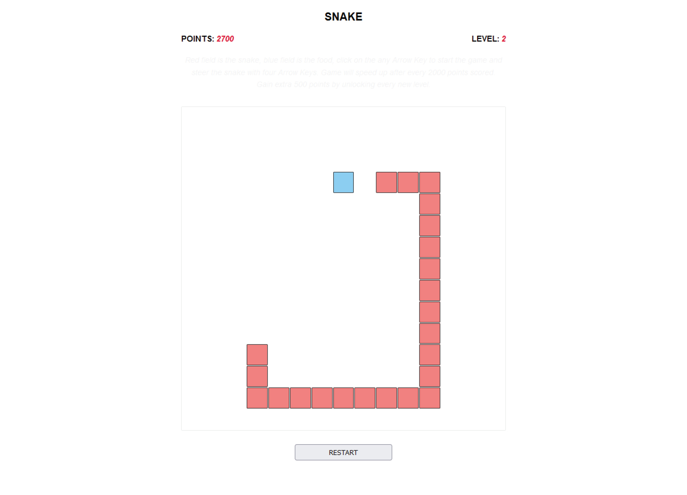
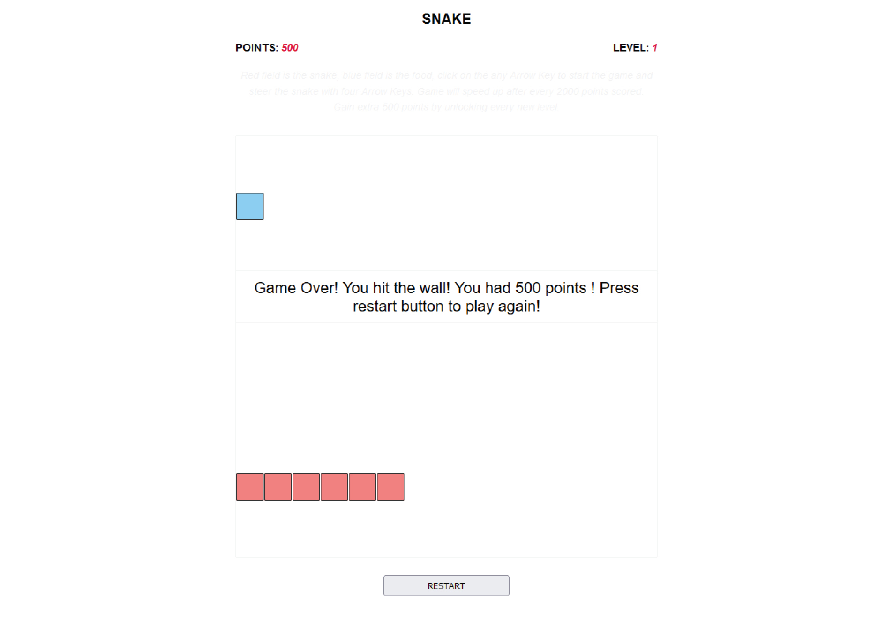
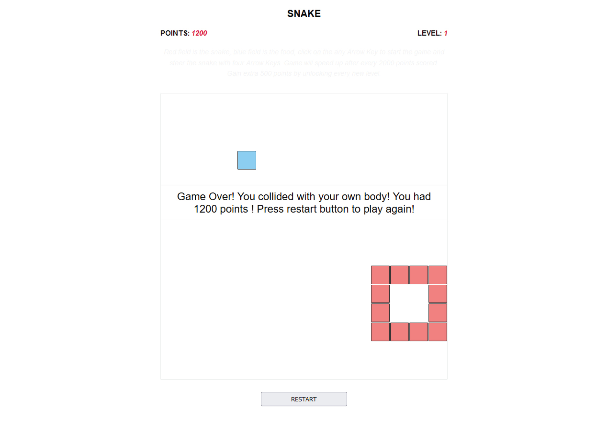

# Snake
 
 
Hello, <a href="https://ivanmpr.github.io/Snake/">here</a> is a classic Snake game project in
my interpretation.
 

 
Game over 'wall collisioin' and UI messages
 

 
Game over 'self collisioin' and UI messages
 

 
Fun and interesting project, I built my <a href="https://ivanmpr.github.io/Tetris/">Tetris</a> project
with settimeout and setinterval methods for the game flow, and I created Snake with requestAnimationFrame,
and that's where the main focus was for me on this game.
